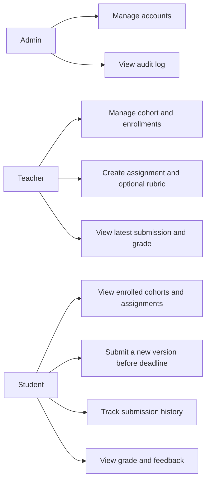
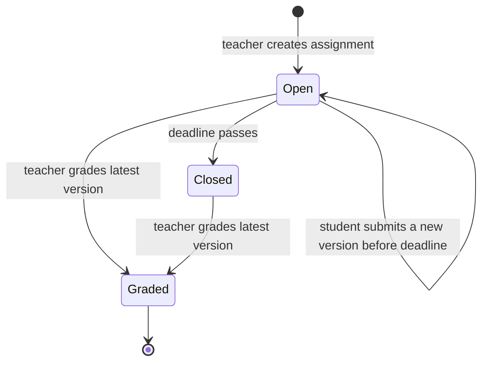
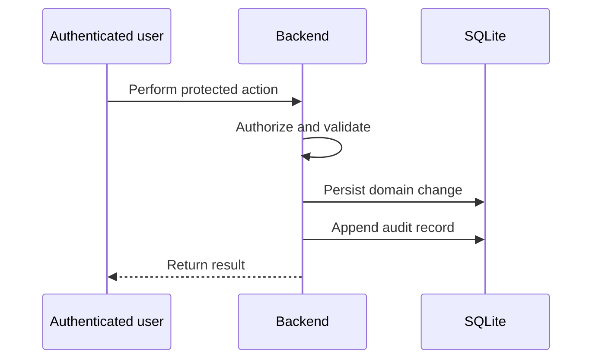

# Use Cases and Flows

## Use cases



## Assignment lifecycle



- `Open`: enrolled students may create a new submission version.
- `Closed`: no new submissions are allowed.
- `Graded`: no new submissions are allowed, regardless of deadline.

## Create, submit, and grade

```mermaid
sequenceDiagram
  participant T as Teacher
  participant S as Student
  participant API as Backend
  participant FS as Local media storage

  T->>API: Create assignment, deadline, optional rubric
  API-->>S: Expose assignment to enrolled student
  S->>API: Upload supported file before deadline
  API->>API: Check enrollment, deadline, ungraded state, and file
  API->>FS: Store file locally
  API-->>S: Create next submission version
  T->>API: Request assignment submissions
  API-->>T: Return only each student's latest version
  T->>API: Submit grade and feedback
  API->>API: Validate scores; calculate rubric total
  API-->>S: Expose result; lock future submissions
```

## Audit flow



Audit writes occur for account administration, cohort and enrollment changes, assignment/rubric changes, submissions, and grading.
