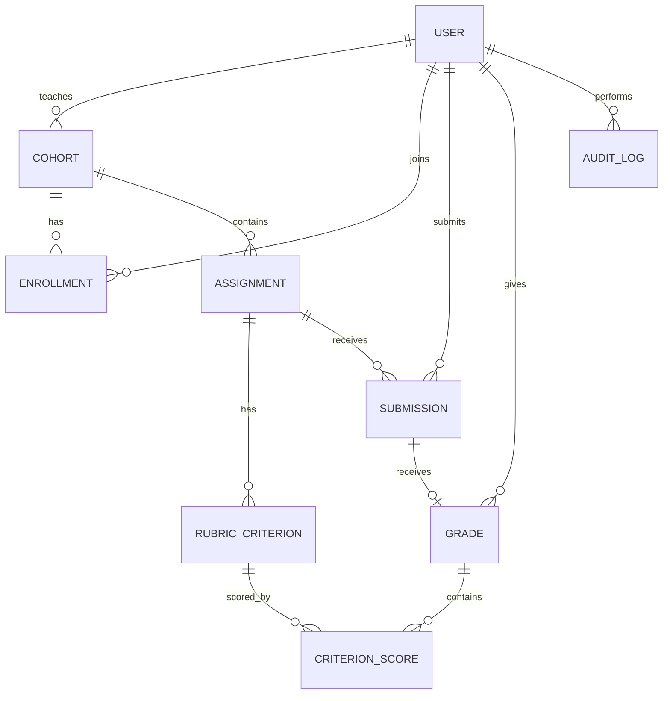

# Data Design and API Contract

## Domain model

## Tables and constraints

| Table | Key fields | Constraints |
|---|---|---|
| `users` | `email`, `password_hash`, `role`, `is_active` | Unique email; role is `ADMIN`, `TEACHER`, or `STUDENT`. |
| `cohorts` | `teacher_id`, `name`, `description` | Teacher owns the cohort. |
| `enrollments` | `cohort_id`, `student_id` | Unique `(cohort_id, student_id)`; student role only. |
| `assignments` | `cohort_id`, `title`, `description`, `due_at`, `max_score` | `max_score` is 100. |
| `rubric_criteria` | `assignment_id`, `title`, `max_score` | Optional per assignment; summed maximum equals 100 when a rubric exists. |
| `submissions` | `assignment_id`, `student_id`, `version`, `file_path`, `file_name`, `mime_type`, `file_size`, `note`, `submitted_at` | Unique `(assignment_id, student_id, version)`. Latest is the greatest version. |
| `grades` | `submission_id`, `teacher_id`, `total_score`, `feedback`, `graded_at` | One grade per submission; `total_score` is 0–100. |
| `criterion_scores` | `grade_id`, `criterion_id`, `score`, `feedback` | Score is within criterion maximum. |
| `audit_logs` | `actor_id`, `action`, `target_type`, `target_id`, `metadata`, `created_at` | Append-only; metadata excludes secrets and raw file content. |

## REST API

All endpoints except login require a JWT Bearer token. Responses use `401` for unauthenticated, `403` for unauthorized, `404` for unavailable resources, and `422` for valid requests that violate a business rule.

| Area | Endpoint | Access |
|---|---|---|
| Authentication | `POST /auth/login`, `GET /auth/me` | Public / authenticated user |
| Accounts | `GET/POST /users`, `PATCH /users/{id}` | Admin |
| Audit | `GET /audit-logs` | Admin; teacher receives only own-cohort events |
| Cohorts | `GET/POST /cohorts`, `GET/PATCH /cohorts/{id}`, `POST /cohorts/{id}/enrollments` | Owning teacher |
| Assignments | `GET/POST /cohorts/{id}/assignments`, `GET/PATCH /assignments/{id}`, `PUT /assignments/{id}/rubric` | Owning teacher |
| Submissions | `POST /assignments/{id}/submissions`, `GET /assignments/{id}/submissions` | Enrolled student / owning teacher |
| Submission history | `GET /assignments/{id}/my-submissions` | Enrolled student |
| Grades | `PUT /submissions/{id}/grade` | Owning teacher |
| Result | `GET /submissions/{id}`, `GET /assignments/{id}/my-result` | Owning teacher or owning student |

Upload requests use `multipart/form-data`. File download/access must re-check authorization; a storage path is never treated as public access.
