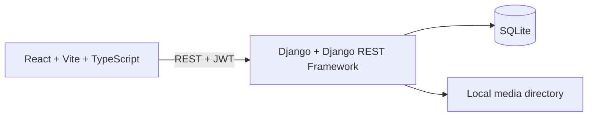

# Technical Design

## Architecture

## Technology choices

| Layer | Choice | Reason |
|---|---|---|
| Web UI | React, Vite, TypeScript, Tailwind CSS | Existing MVP design; fast local development and typed UI. |
| API | Django, Django REST Framework | Built-in auth, ORM, validation, and test support. |
| Authentication | SimpleJWT | Stateless local API authentication. |
| Database | SQLite | Local-only MVP. |
| Files | Django local media storage | Supports the local-only requirement without an external service. |
| End-to-end checks | Playwright | Verifies the teacher-to-student browser flow. |

## Security and validation

- Django password hashing and JWT authentication protect accounts.
- Every protected endpoint verifies role and object ownership on the server.
- A submission requires enrollment, an unexpired deadline, and no existing grade for that student/assignment.
- The backend validates extension, MIME type, and a maximum file size of 1 GB before persisting the file.
- Local media files are served/downloaded only through an authorization-checked route.
- Audit records are append-only and contain no passwords, tokens, or raw uploaded content.

## UI responsibilities

| Screen | Main content |
|---|---|
| Login | Email, password, and readable authentication errors. |
| Admin users | List, create, edit, activate/deactivate accounts; read-only audit log. |
| Teacher dashboard | Owned cohorts, upcoming deadlines, and submissions needing grades. |
| Cohort detail | Cohort data, enrolled students, and assignments. |
| Assignment detail | Description, deadline, rubric, and latest student submissions. |
| Student dashboard | Enrolled cohorts, open assignments, and recent grades. |
| Student assignment | Assignment details, upload form, version history, and state. |
| Grading | Criterion scores or manual total, feedback, and calculated total. |
| Result | Total score, feedback, and rubric breakdown. |
