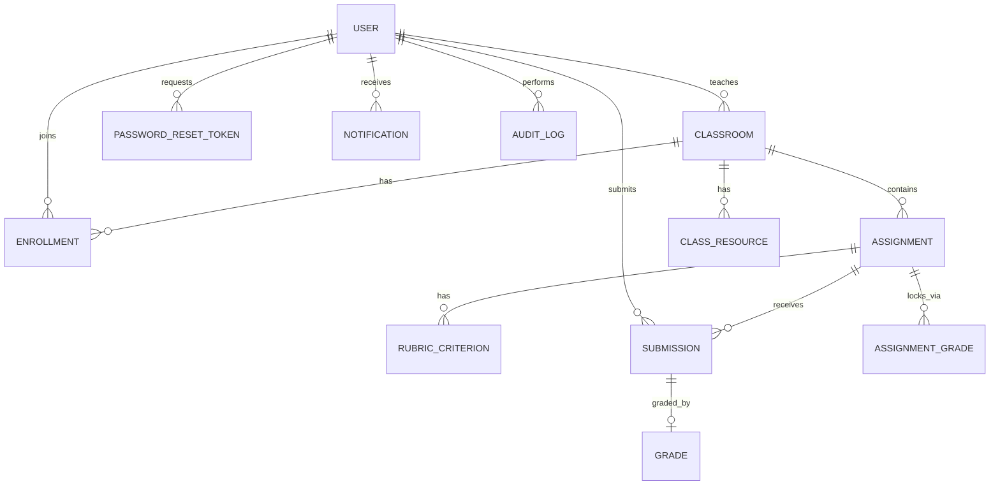
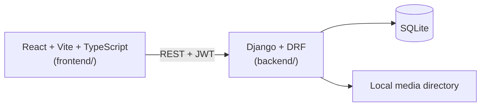

# Class Management System — Overview

This document is the entry point for understanding the system. Feature-level detail (screens, API, DB, functions) lives in the sibling `NN-feature-*.md` files in this folder; each links back here.

> **This folder is the target design, not a description of the current code.** `backend/` and `frontend/` are being brought in line with it — where they disagree, these documents win and the code is the thing that needs changing. `docs/ba/` holds the original product requirements spec: read this folder for the design being built, and `docs/ba/` for the original intent/history.
>
> **On "not built yet" notes.** These documents describe the target, so most of them are ahead of the code in places. Individual gaps are tracked in `docs/plans/` (one plan per feature doc) rather than annotated inline here — **the absence of a note is not evidence that the code matches.** Treat every doc here as the spec and verify against the code before assuming an endpoint exists.
>
> **Altitude.** These docs stop at screens, API, DB and rules — no file goes below the component level. Where a doc names a CSS token, a class name or a `z-index` ([07 §2.1](07-notifications-and-resources.md#21-notification-bell-appshell-teacherstudent-only--not-shown-for-admin)), it is because the value has to agree with something that already exists in the app, not because the styling is being specified here.

## 1. Business context

Internal tool for running an AI-training program: administrators onboard accounts, teachers run classes and coursework, students do the coursework and get graded. Everything runs locally — no self-registration, no external notifications, no cloud storage, no AI-assisted grading.

## 2. Actors

| Role | Can do |
|---|---|
| `ADMIN` | Create/edit/disable/soft-delete accounts and set an account's password directly, create Classes and manage roster (enroll/unenroll students, assign a teacher), read the audit log. Does not touch coursework content (assignments, rubrics, grading). Password *reset* is self-service by email link — there is no admin-resolved reset queue ([01](01-auth-and-accounts.md)). |
| `TEACHER` | Manage assignments, rubrics, and grading only within Classes they own. Create Class resources (links). View roster, progress, and a read-only gradebook for their own Classes. |
| `STUDENT` | View enrolled Classes, submit coursework before the deadline, view own submission history, grades, and feedback. |

Accounts are always admin-provisioned (`must_change_password` forces a password change on first login after creation, or after an admin sets the account's password directly).

## 3. Core domain concepts

- **Class** (was "Cohort" in the original spec) has a `starts_at`/`ends_at` window and an `is_active` flag (admin-only Bật/Tắt, only switchable off before the Class starts). Coursework (assignments, submissions) is only open while `is_active and starts_at <= now < ends_at`, in addition to each assignment's own `due_at`. Classes are never deleted.
- **Assignment** belongs to a Class, has a `due_at`, a fixed `maximum_score` of 100, and an optional rubric (criteria summing to 100).
- **Submission** is versioned per (assignment, student). A student can re-upload as long as the Class/assignment window is open and no grade exists yet; a teacher only ever sees the latest version.
- **Grade** is created once per (assignment, student) — either from rubric criterion scores (server sums them) or a manual total (0–100) when no rubric exists. Grading is final: creating a `Grade` also writes an `AssignmentGrade` lock row that blocks further submissions and further grading.
- **Notification** rows fan out to every enrolled student when a teacher creates an assignment or a Class resource.
- **AuditLog** is an append-only table (DB-level: update/delete raise) written for every account, Class, enrollment, assignment, rubric, submission, and grading action.

## 4. High-level architecture

| Layer | Choice |
|---|---|
| Frontend | React, TypeScript, Vite, Bootstrap classes, hand-rolled path router in `main.tsx` (no react-router) |
| Backend | Django + Django REST Framework, one Django app per bounded context (`accounts`, `classes`, `assignments`, `submissions`, `grading`, `audit`, `notifications`) |
| Auth | JWT (SimpleJWT), `Authorization: Bearer <token>` on every endpoint except the four public ones: `POST /api/auth/login`, `POST /api/auth/forgot-password`, `GET /api/auth/reset-password/{token}`, `POST /api/auth/reset-password` |
| DB | SQLite (local-only) |
| Files | Django local media storage, served only through an authorization-checked download endpoint — never a public file URL |
| Email | Django's console backend (`EMAIL_BACKEND = django.core.mail.backends.console.EmailBackend`) — password-reset links print to server stdout. Swapping to real SMTP is a settings-only change ([01 §5](01-auth-and-accounts.md#5-key-functions--rules)) |
| Rate limiting | `django-ratelimit`, on `POST /api/auth/forgot-password` only (1/min per email, 5/hour per IP). No other endpoint is throttled |

## 5. Backend apps → feature docs map

| Django app | Feature doc |
|---|---|
| `accounts` | [01-auth-and-accounts](01-auth-and-accounts.md) |
| `classes` (Class, Enrollment) | [02-classes-and-enrollment](02-classes-and-enrollment.md) |
| `classes` (ClassResource) | [07-notifications-and-resources](07-notifications-and-resources.md) |
| `assignments` | [03-assignments-and-rubrics](03-assignments-and-rubrics.md) |
| `submissions` | [04-submissions](04-submissions.md) |
| `grading` | [05-grading-and-results](05-grading-and-results.md) |
| `classes` (Gradebook views) | [06-gradebook](06-gradebook.md) |
| `notifications` | [07-notifications-and-resources](07-notifications-and-resources.md) |
| `audit` | [08-audit-log](08-audit-log.md) |
| `dashboard` | [09-dashboard](09-dashboard.md) |

## 6. Cross-cutting rules (apply to every feature)

1. **Server is the source of truth for authorization.** Every view re-derives what a user is allowed to see/do from `role` + ownership (`teacher_id`, enrollment) — the UI never gates access on its own.
2. **Class window gates coursework.** `is_open(class) = is_active and starts_at <= now < ends_at`. Assignments/rubrics/submissions all additionally check this, on top of `due_at` for submissions. A Class with `is_active = false` is invisible to Teachers and Students entirely (`404`), not merely read-only.
3. **Grading is a one-way door.** Once a `Grade` (and its `AssignmentGrade` lock) exists for a (assignment, student) pair, no more submissions and no re-grading are possible for that pair.
4. **Audit metadata holds no strings at all.** `audit.services.safe_metadata` drops secret-looking keys, `bytes`, and — the part that surprises people — **every plain string value**, path-like or not. What survives is numbers, booleans, and lists/dicts of those. So passwords, tokens and file contents cannot land in `audit_logs`, but neither can any human-readable text you meant to keep: pass IDs and counts, never free text. Details and the consequences in [08 §5](08-audit-log.md#5-key-functions--rules).
5. **HTTP status convention**: `401` unauthenticated, `403` unauthorized, `404` not found/not in scope, `422` valid request that violates a business rule.
6. **Bilingual UI**: labels are a mix of English and Vietnamese as shipped in the current frontend (e.g. "Bảng điểm" = Gradebook, "Nộp bài" = Submit). Feature docs preserve the actual on-screen strings.

## 7. Reading order

New to the system → read this file, then `02-classes-and-enrollment.md` → `03-assignments-and-rubrics.md` → `04-submissions.md` → `05-grading-and-results.md` in that order; that's the main teaching-cohort lifecycle. `01`, `06`, `07`, `08` are supporting features you can read independently.
